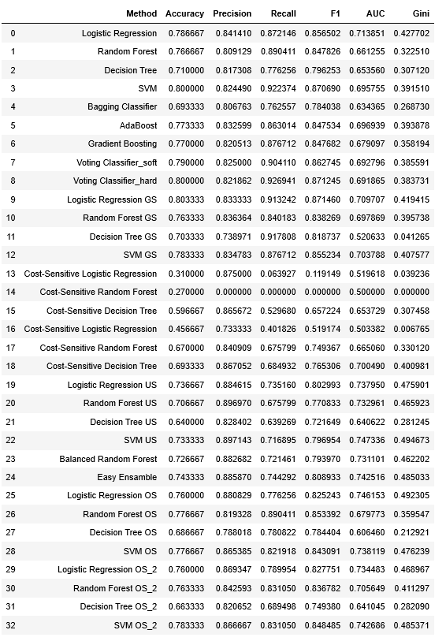

# CreditScoringModel
The project is made at the end of 6 months course [Kodołamacz Bootcamp Data Science](https://www.kodolamacz.pl/bootcamp-datascience/)

## Project Aim

The aim of this project is to predict whether the customer will pay off a loan based on his/ her historical data. The customers are differentiate between good and bad customers. Therefore the bank can decide either it should grant a loan to the customer or the investment is doomed to failure.

## Dataset

The dataset comes from [UCI Machine Learning Repository](https://archive.ics.uci.edu/ml/datasets/Statlog+%28German+Credit+Data%29). More info about data is in attached file _Data_Set_Desctiption.txt_

## Technologies

- Python 3.7
- Pandas
- Numpy
- Matplotlib
- Seaborn
- Scikit-learn
- Costcla
- Imblearn

## Algorithms

- Logistic Regression
- Decision Tree
- Random Forest
- SVM
- Bagging
- AdaBoost
- Gradient Boosting
- Voting Classifier 
- Cost-sensitive Logistic Regression
- Cost-sensitive Decision Tree
- Cost-sensitive Random Forest
- Balanced Random Forest
- Easy Ensamble

## Jupyter notebooks:

- Exploratory Data Analysis
- Modeling

## Final results:

During this analysis the best models to distinguish good and bad customers on this dataset were **SVM implemented with undersampled majority class** _(Gini = 0.495)_ and **Logistic regression with oversampled minority class (SMOTE)** _(Gini = 0.492)_. The models were evaluated based on Gini Coefficient that is common measure for credit risk models, however, the other scores such as Accuracy, Precision, Recalll, F1 and AUC were also verified. 

For **Logistic regression with oversampled minority class (SMOTE)** the following features were distinguished as the most significant: whether the customer is foreign worker, the current account status, the purpose of the credit, the amount of savings, credit history and other debtors/ guarantors.
